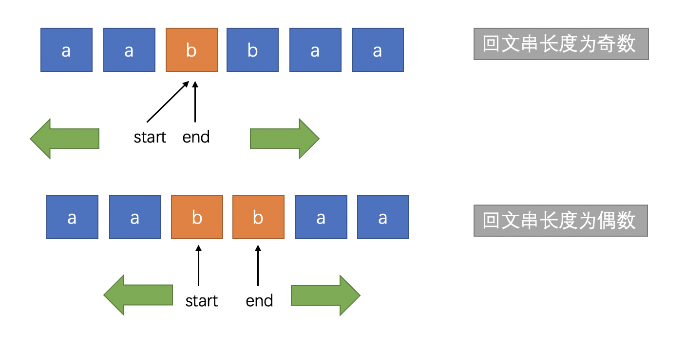

## 数组相关问题

### 3.无重复字符的最长子串
- 滑动窗口指针，并记录窗口元素，使用集合；
- 终止条件 left <= right；

### 75.颜色排序
- 三指针；left,cur,right；

### 80.删除有序数组中的重复项 II
- 注意：用nums[left-1] == nums[left]判断是否存在多余两个的重复项；

### 209.长度最小的子数组
- 滑动窗口指针，并记录窗口中数字总和；

### 215.数组中的第K个最大元素

### 647.回文子串
- 中心扩展法；
- 区分回文串长度为奇数或者偶数；

