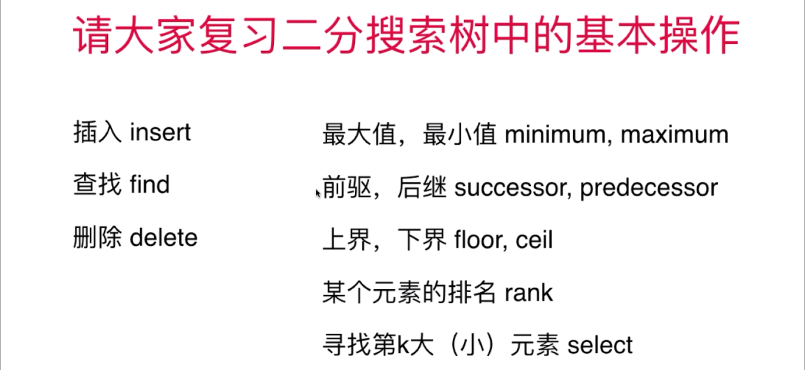

## 二叉树问题

### 剑指 Offer 33. 二叉搜索树的后序遍历序列
- 使用递归的方法实现，将数组进行切分；
- 切分成：左子树、右子树、根结点；然后对左子树、右子树再进行递归验证；

### 101.对称二叉树
- 分别搜索：`node1->left, node2->right; node1->right, node2->left`

### 104.二叉树的最小深度
- 对于左孩子或者右孩子，其中一个为NULL的情况；需要特殊处理；（注意 -> 递归终止条件）
- **NOTE: 对于二叉树问题，对于左右子树是否为空需要考虑；**

### 113.路径总和 II
- 深度优先搜索，并回溯；红色箭头表示回溯过程；

### 114.二叉树展开为链表
- 使用三个指针：cur, pre, next

### 226.翻转二叉树
- 先反转左右子树中结点；
- 然后在反转左右子树，根结点；

### 二分搜索树
- 二分搜索树定义：每个节点的键值大于左孩子，且小于右孩子；并且以左孩子、右孩子为根的子树仍为二分搜索树；

