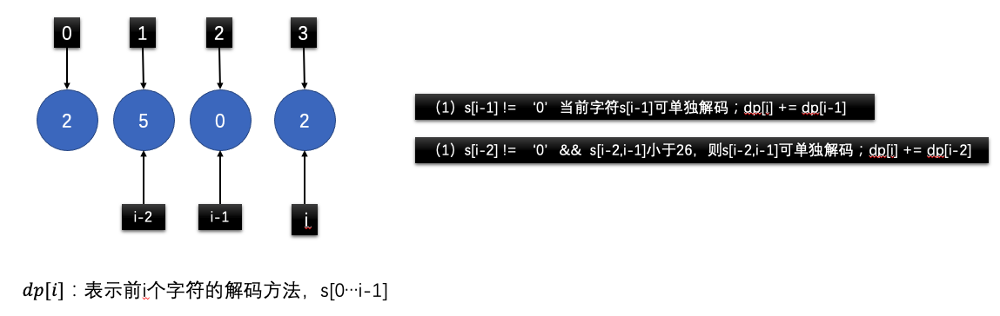

## 动态规划

### 91.解码方法
1.dp[i]表示前i个字符s[0...i-1]的解码方法；答案返回dp[n]；
2. 如果当前字符 `s[i-1] != '0'`，则表示s[i-1]可以单独解码；则 `dp[i] += dp[i-1]`；
3. 如果`s[i-2] != '0' && s[i-2,i-1] <=26`，表示s[i-2,i-1]可以单独解码；则 `dp[i] += dp[i-2]`；

