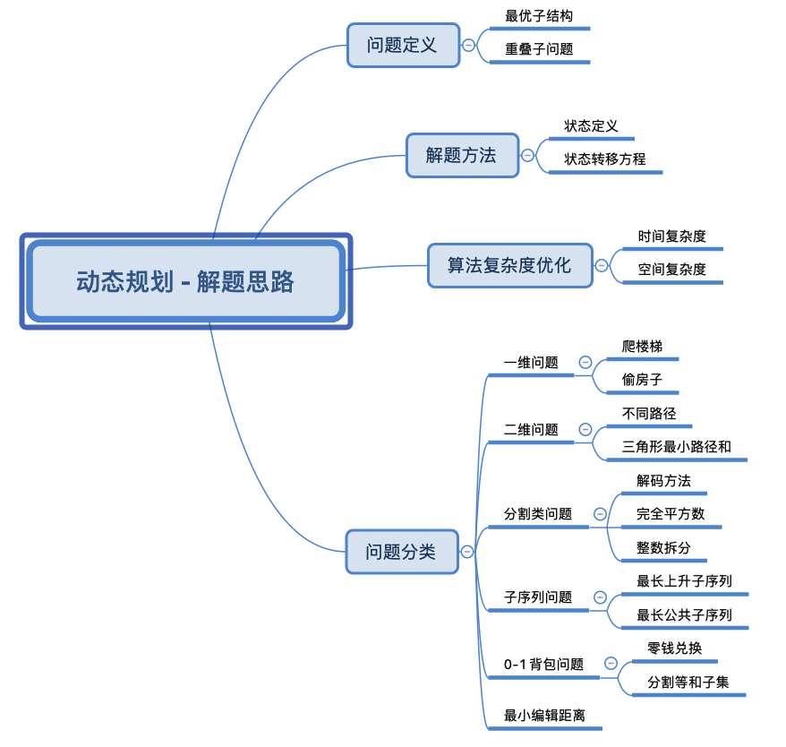
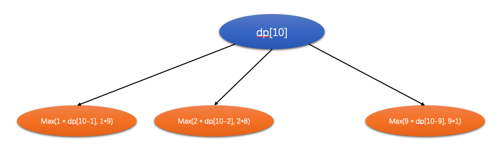
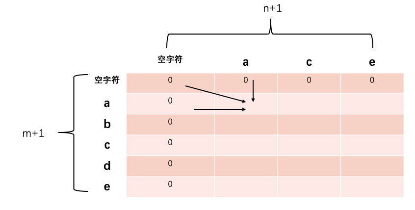
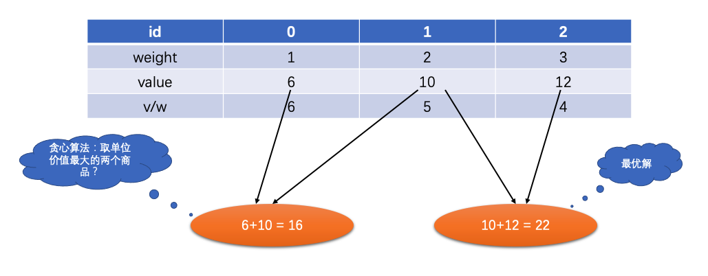
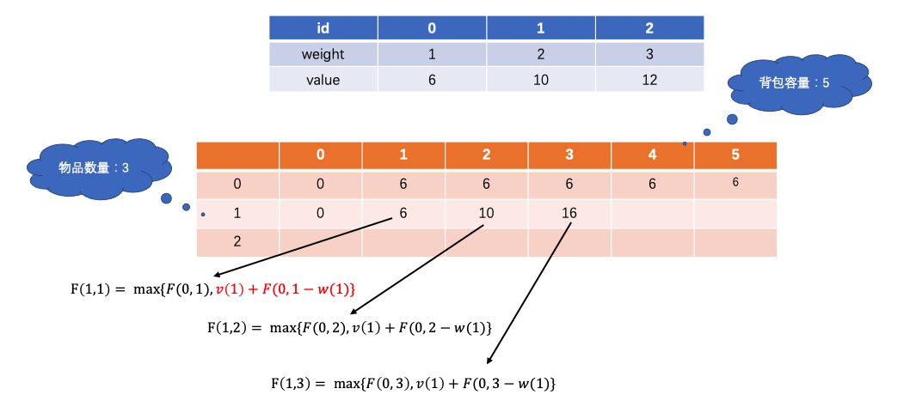
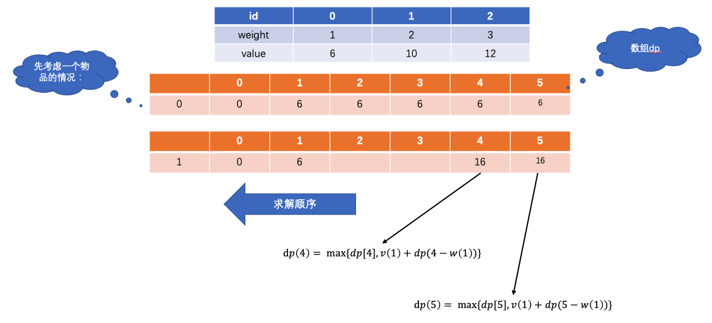

## 动态规划

> 解题思路

> 未做出题目汇总
- 63.不同路径 II
- 300.最长递增子序列
- 337.打家劫舍 III
- 416.分割等和子集

### 343.整数拆分
- 状态转移方程：`dp[i] = max{(dp[i-j*j], (i-j)*j), j=1,2,...,i-1}`

### 1143.最长公共子序列
- dp[i][j]表示字符子串text1[0...i-1]和字符子串text2[0...j-1]的最长公共子序列；
- （1）如果text1[i-1] == text2[j-1]，则dp[i][j] = dp[i-1][j-1] + 1;
- （2）否则取下面两个最大值：text1[0...i-2], text2[0...j-1]最长公共子序列：dp[i-1][j]
- （3）text1[0...i-1], text2[0...j-2]最长公共子序列：dp[i][j-1]
- **状态转移方程：dp[i][j] = max(dp[i-1][j], dp[i][j-1]；**

### 0-1 背包问题 `难度：***`
- 有一个背包，它的容量为C；现在有n种不同的物品，编号为0...n-1；其中每一件物品的重量为`w(i)`，价值为`v(i)`。
- 问可以向这个背包中盛放哪些物品，使得在不超过背包容量的基础上，物品的总价值最大？

#### 1）贪心算法解决？
- 优先放入单位价值最高的物品？
- **注意：贪心算法不能够找到最优解；**

#### 2）动态规划？

#### 2.1) 空间复杂度O(n*C)
- `F(n,c)`表示将n个物品放进容量为C的背包，使得价值最大；
- 状态转移方程：`F(n, c) = max{F(n-1, c), v(i) + F(i-1, c-w(i)}`
- (1)第一项，表示不将物品i放入背包中；
- (2)第二项，表示将物品i放入背包中；
- 最终最优答案：22；

#### 2.2) 空间复杂度O(C)
- 首先，考虑一个物品的情况；将一个物品放入背包中。
- 仍然，从右到左`C -> 0`，填满数组dp；

### 完全背包问题
- NOTE：每个物品可以无限使用；

