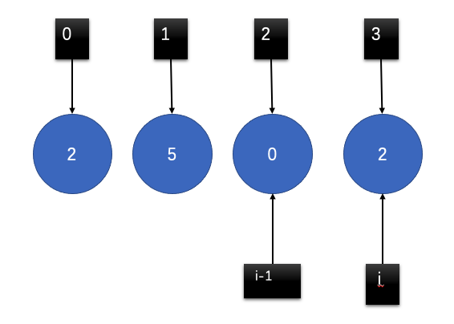

## 动态规划

### 343.整数拆分
- 状态转移方程：`dp[i] = max{(dp[i-j*j], (i-j)*j), j=1,2,...,i-1}`

### 91.解码方法
- 1.dp[i]表示字符s[0...i]的解码方法；答案返回dp[n-1]；
- 2.如果当前字符 `s[i] != '0'`，则表示s[i]可以单独解码；则 `dp[i] += dp[i-1]`；
- 3.如果`s[i-1] != '0' && s[i-1,i] <=26`，表示s[i-1,i]可以单独解码；则 `dp[i] += dp[i-2]`；
- 4.注意对于`i=0, i=1`的特殊处理；

### 0-1 背包问题
- 有一个背包，它的容量为C；现在有n种不同的物品，编号为0...n-1；其中每一件物品的重量为`w(i)`，价值为`v(i)`。
- 问可以向这个背包中盛放哪些物品，使得在不超过背包容量的基础上，物品的总价值最大？

#### 1）贪心算法解决？
- 优先放入单位价值最高的物品？
- **注意：贪心算法不能够找到最优解；**

#### 2）动态规划？
- `F(n,c)`表示将n个物品放进容量为C的背包，使得价值最大；
- 状态转移方程：`F(n, c) = max{F(n-1, c), v(i) + F(i-1, c-w(i)}`
- (1)第一项，表示不将物品i放入背包中；
- (2)第二项，表示将物品i放入背包中；
- 最终最优答案：22；

