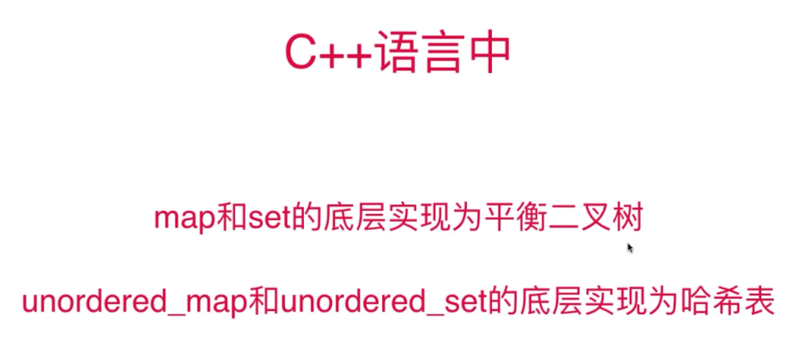

## 哈希表相关问题

> 解题思路

> 未做出题目汇总
- 15.三数之和
- 16.最接近的三数之和
- 202.快乐数
- 220.存在重复元素 III 
- 447.回旋镖的数量

### 15.三数之和
- 使用三指针； 
- 首先需要对数组进行排序，其次对cur,left,right每一个位置都进行去重操作；

### 220.存在重复元素 III
- 每一次拿窗口之外的下一个元素和窗口内的元素进行对比；
- 看窗口中是否存在满足条件的元素v：x-t <= v <= x+t；

### 447.回旋镖的数量
- map中存放其他点到当前点：**距离 -> 数量** 映射关系；

### set,map和unordered_set,unorder_map之间的区别

