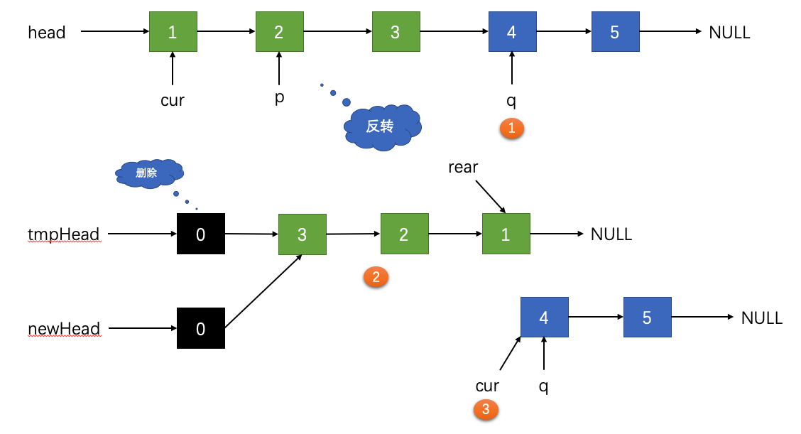
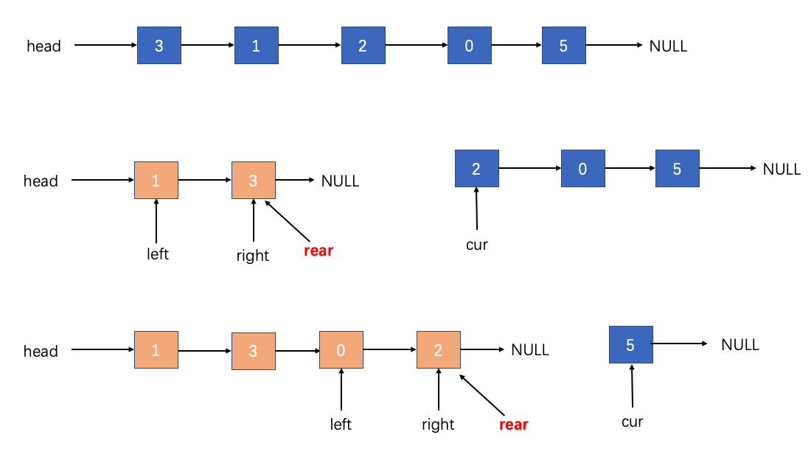
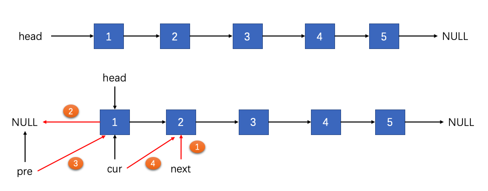
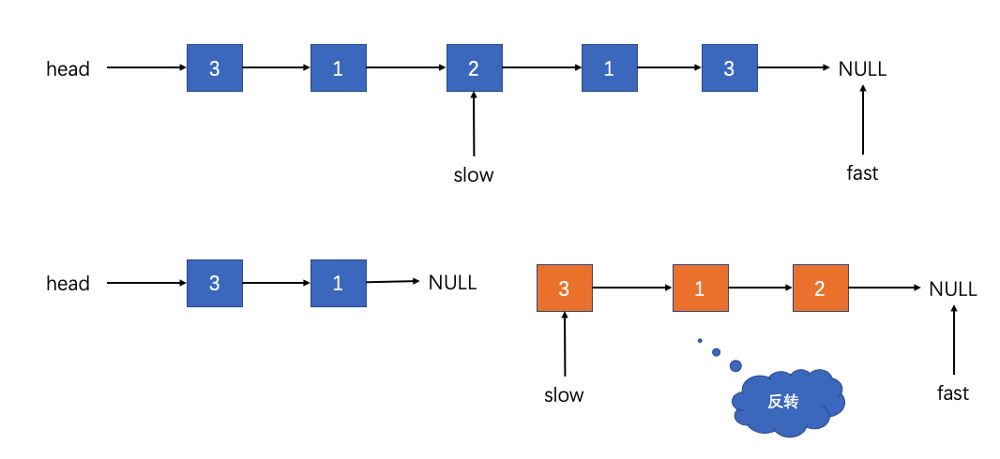
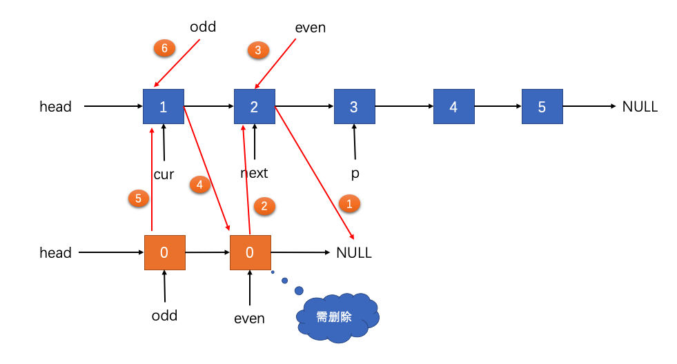

## 链表问题

> 解题思路

> 未做出题目汇总
- 25.K 个一组翻转链表；
- 142.环形链表 II；
- 143.重排链表；
- 148.排序链表；

### 25.K个一组翻转链表

### 142.环形链表 II

### 148.排序链表

### 206.链表反转
- 另外一种思路，每次在头结点进行插入；

### 234.回文链表

### 328.奇偶链表

