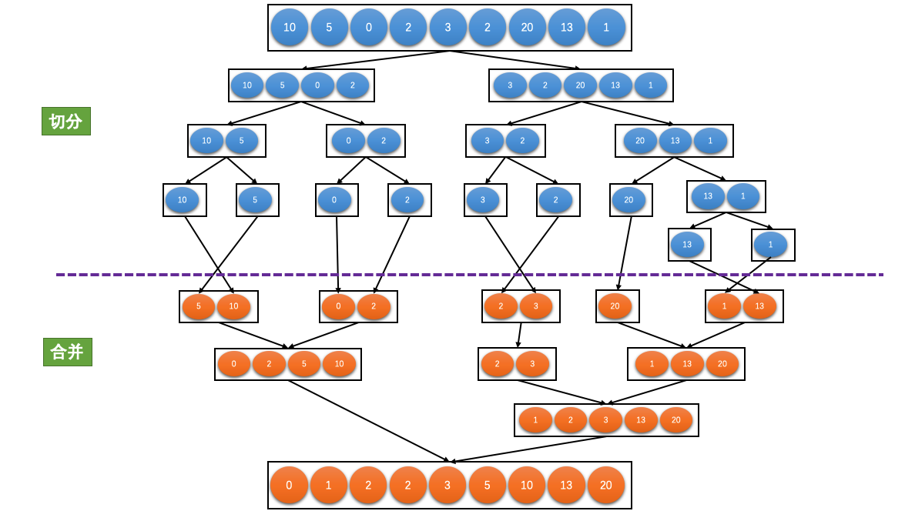

## 经典排序算法

### 1.堆排序
- 堆是一棵完全二叉树；
- 堆一般有两种，大顶堆和小顶堆；大顶堆对应结点的值都大于其左右孩子结点的值；小顶堆对应结点的值都小于等于其左右孩子结点的值；
- 

### 2.快速排序
- 快排序采用递归的思想实现；做完一趟快速排序之后，分别在[left, pivotIdx-1]，[pivotIdx+1, right]继续做一趟快速排序；

### 3.归并排序
- 先二分切分数组；然后合并排序后的数组；

