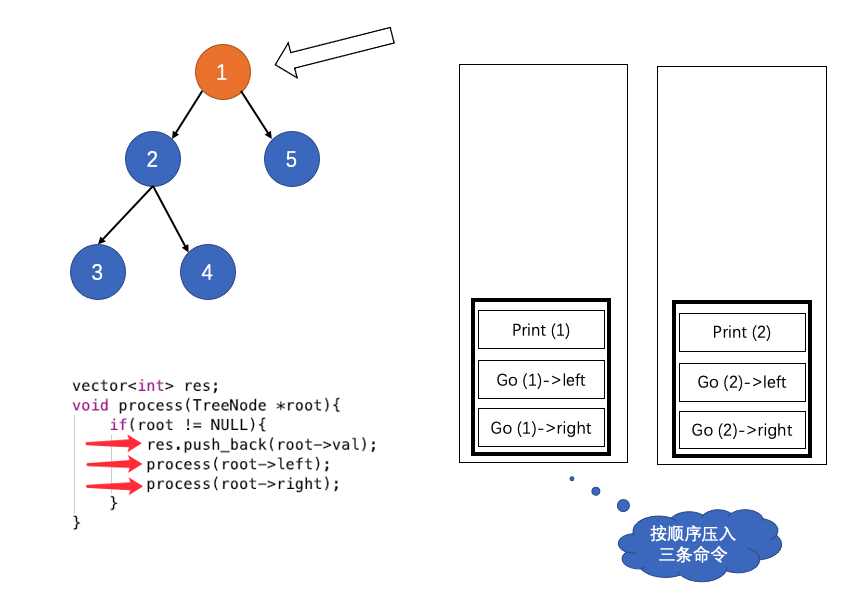

## 栈，队列，堆问题

### 144. 二叉树前序遍历
- 相当于每次访问每个结点的时候：插入三条命令；【这种方式可以统一前，中，后序遍历】

### 199. 二叉树的右视图
- 注意每一次循环，插入当前层的所有结点；

### 279. 完全平方数
- 广度优先搜索 + 队列解决最短路径问题；注意：需要使用visited记录已经被访问的结点；
- NOTE：此题另外一种解法，动态规划：dp[n] = min{dp[n-1], dp[n-2*2], ..., dp[n-k*k]}

### 127. 单词接龙
- 如果两个单词，相差一个字符并且未被访问，则加入队列中；
- 注意：每次将访问过的单词，从wordList中删除节省搜索时间；
- NOTE：最优解法是从两端进行搜索；

