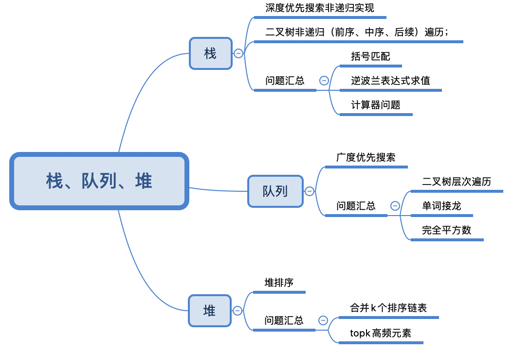
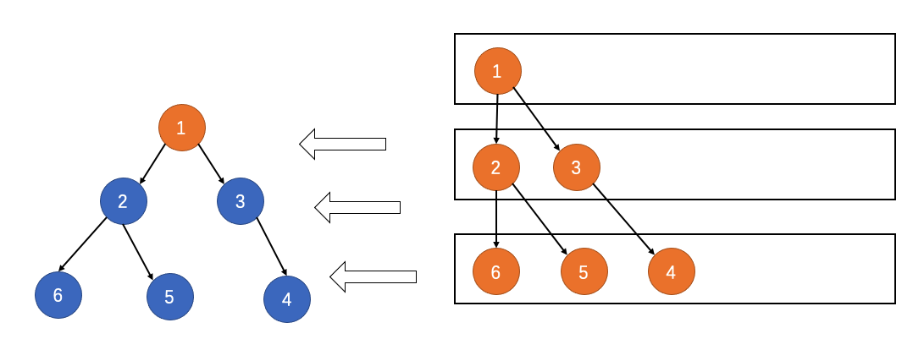

## 栈，队列，堆问题
> 解题思路



> 未做出题目汇总
- 71.简化路径
- 127.单词接龙
- 227.基本计算器 II


### 23. 合并K个升序链表
- 维护一个大小为K的最小堆；每次循环压入堆顶元素的下一个元素；


### 127. 单词接龙
- 如果两个单词，相差一个字符并且未被访问，则加入队列中；
- 注意：每次将访问过的单词，从wordList中删除节省搜索时间；
- NOTE：最优解法是从两端进行搜索；

  

### 144. 二叉树前序遍历
- 相当于每次访问每个结点的时候：插入三条命令；【这种方式可以统一前，中，后序遍历】

  

### 199. 二叉树的右视图
- 注意每一次循环，插入当前层的所有结点；



### 227. 基本计算器 II


### 279. 完全平方数
- 广度优先搜索 + 队列解决最短路径问题；注意：需要使用visited记录已经被访问的结点；
- NOTE：此题另外一种解法，动态规划：dp[n] = min{dp[n-1], dp[n-2*2], ..., dp[n-k*k]}


### 优先队列（堆）
- 底层实现即为：堆
```c++
//
// Created by 陈志明 on 2020/5/22.
//
#include <iostream>
#include <vector>
#include <queue>
using namespace std;

bool myCmp(int a , int b){
    if(a%10 != b%10)
        return a%10 > b%10;
    return a > b;
}

int main() {

    priority_queue<int> heap;

    // 建立堆，默认是最大堆
    for(int i = 0 ; i < 10 ; i ++){
        int num = rand() % 100;
        heap.push(num);
    }

    while(!heap.empty()){
        cout<<heap.top()<<" ";
        heap.pop();
    }
    cout<<endl;

    // 生成最小堆
    priority_queue<int, vector<int>, greater<int>> heap2;

    for(int i = 0 ; i < 10 ; i ++){
        int num = rand() % 100;
        heap2.push(num);
    }

    while(!heap2.empty()){
        cout<<heap2.top()<<" ";
        heap2.pop();
    }
    cout<<endl;

    // 使用自定义Comparator的priority queue
    priority_queue<int, vector<int>, function<bool(int,int)>> heap3(myCmp);


    for(int i = 0; i < 10; i ++){
        int num = rand() % 100;
        heap3.push(num);
    }

    while(!heap3.empty()){
        cout << heap3.top() << " ";
        heap3.pop();
    }


    return 0;
}
```
